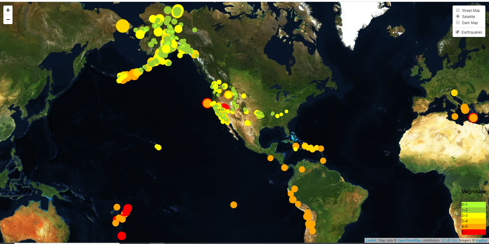
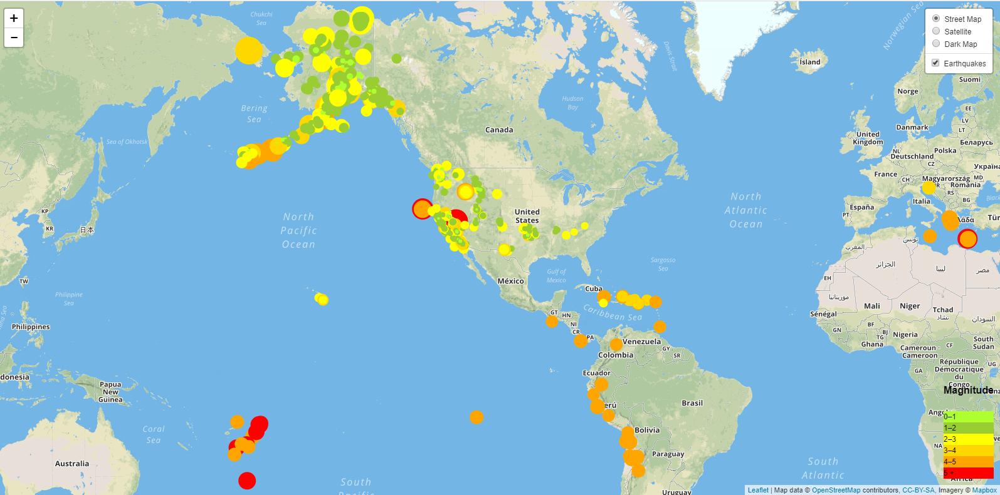
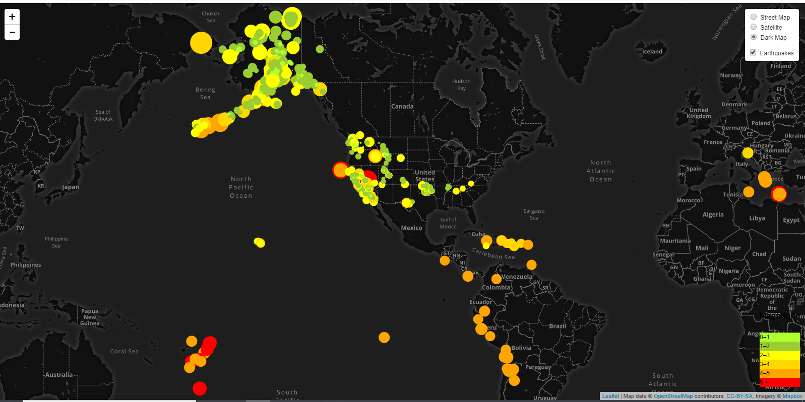

# Javascript Geo-Mapping

1. **Get your data set**

   

   The USGS provides earthquake data in a number of different formats, updated every 5 minutes. Visit the [USGS GeoJSON Feed](http://earthquake.usgs.gov/earthquakes/feed/v1.0/geojson.php) page and pick a data set to visualize. When you click on a data set, for example 'All Earthquakes from the Past 7 Days', you will be given a JSON representation of that data. You will be using the URL of this JSON to pull in the data for our visualization.

   

2. **Import & Visualize the Data**

   Create a map using Leaflet that plots all of the earthquakes from your data set based on their longitude and latitude.

   * Your data markers should reflect the magnitude of the earthquake in their size and color. Earthquakes with higher magnitudes should appear darker in color.

   * Include popups that provide additional information about the earthquake when a marker is clicked.

   * Create a legend that will provide context for your map data.

   * Your visualization should look something like the map above.
   
  
  # Plotting the Maps 
  
  Three different maps were made to display the circles, which represent earthquakes that occurred over this 7 day stretch. I used the Mapbox website to obtain an API Key along with the leaflet library of Javascript to be able to show the map visual. The circles were plotted in correlation to the latitude and longitudes of the earthquake locations. A legend was created and positioned to the bottomright of the page to differentiate the magnitudes of the earthquakes based on the color range. Light green to yellow indicate that the earthquake's magnitude is between 0-3. Whereeas earthquake's that have magnitudes higher than are indicated with more darker colors such as dark orange and dar kred. A tooltip was created where if you click a circle, it will show you the distance from a city of an earthquake, the date/time of an earthquake, and the magnitude. The following three maps are shown below:
  
  # Satellite Map 
  
  
  
  # Basic(Street) Map
  
  
  
  # Dark Map
  
  
  
  # Magnitude Legend
  
  
  
  
  
  
